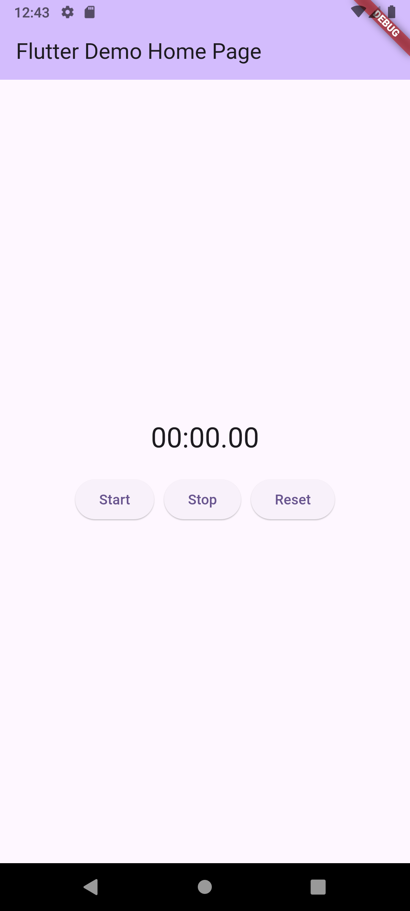

# simple_stopwatch

A simple stopwatch application built with Flutter.

## Features

- Start, Stop, and Reset functionality.
- Displays time in minutes, seconds, and milliseconds.

## Screenshot

Here's a screenshot of the application:

| Screenshot |
| :---: |
|  |

## How to Use

1. Tap the 'Start' button to begin the stopwatch.
2. Tap the 'Stop' button to pause the stopwatch.
3. Tap the 'Reset' button to clear the stopwatch and set it back to zero.

## Getting Started

This project is a starting point for a Flutter application.

A few resources to get you started if this is your first Flutter project:

- [Lab: Write your first Flutter app](https://docs.flutter.dev/get-started/codelab)
- [Cookbook: Useful Flutter samples](https://docs.flutter.dev/cookbook)

For help getting started with Flutter development, view the
[online documentation](https://docs.flutter.dev/), which offers tutorials,
samples, guidance on mobile development, and a full API reference.
